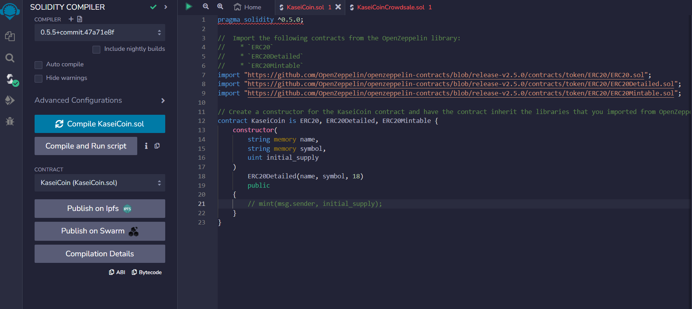
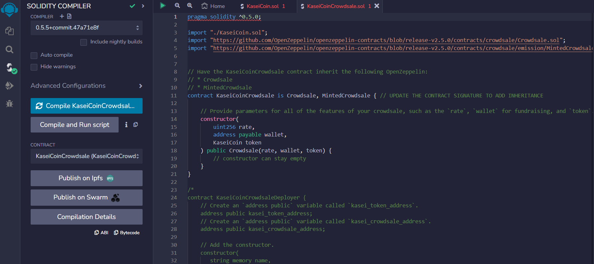
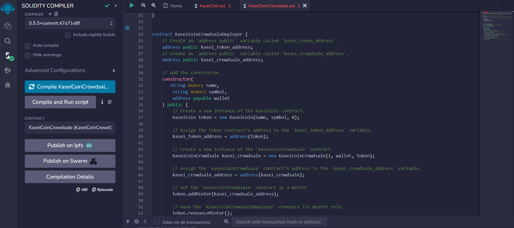

#KaseiCoin CrowdSale

---

### Table of Contents

* [Overview](#overview)
* [Requirements](#requirements)
* [Evaluation Evidence](#evaluation-evidence)
* [User Experience](#user-experience)
* [License](#license)  

---

## Overview

We created a fungible token called to kaseiCoin that is ERC-20 compliant for a Crowdsale contract from the OpenZeppelin Solidity library. You will learn to deploy three contracts to manage the entire crowdsale process.

---

## Requirements

This project leverages python version 3.7.11 with the following packages and modules:

- Solidity - Create the smart contract and implement the joints saving application to work with ether.

- Remix IDE - Write and edit solidity code to create the contracts

- MetaMask - Use digital wallet and a gateway for the Ethereum blockchain.

- Ganache - This is a tool that allows us to quickly set up a local blockchain, which we can use to test and develop smart contracts.

- OpenZeppelin - OpenZeppelin library provides a wide variety of contracts that are related to the ERC-20 token standard.

---

## Evaluation Evidence

### Step 1: Screenshot of the successful compilation of the kaseiCoin contract:

### Step 2: Screenshot of the successful compilation of the kaseiCoinCrowdsale contract:

### Step 3: Screenshot of the successful compilation of the kaseiCoinCrowdsaleDeployer contract:

### Step 4: KaseiCoinCrowdsaleDeployer Contract Demo

### Step 5: KaseiCoinCrowdsale Contract Demo

